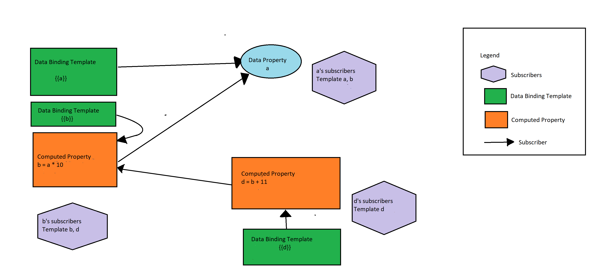

### A Deep dive into the Reactivity system of Vue.js 

By ShipBob (Abhishek Raj, Jason Buss)


---

#### Intro


<p style="font-size:20px;float:left;margin-left:133px;">Abhi, Software Engineer at ShipBob</p>
<p style="font-size:20px;float:left;margin-left:50px;">Jason, Javascript Engineer at ShipBob</p>
---

#### Goal

> Using vanilla JS, we can acheive a minimalistic declarative rendering framework

---

#### Disclaimer
> What we are going to discuss is just the basic concept of reactivity. Vue.js does a lot of complex things on top of this

---
#### Agenda

- What causes a change in JS
- How JS Frameworks react to changes
- Declarative Rendering
- Getters & Setters
- Tracking dependencies
- Live Demo
- Q&A

---

#### What causes a change in JS

Anything asynchronous in nature causes change in JavaScript.
Example:
- Event listeners
- Timeouts
- Network request callbacks

--- 

#### How JS Frameworks react to changes
---
#### Server side rendering (Back in the days…)
> I don't know how to handle change, use your server and sync the DOM for me
---
#### Manual rendering (Backbone.js)
> I can tell you when something has changed, but it is upto you to sync the DOM
---
#### Data Binding (Ember.js)
> I can tell you what exactly has changed, and i will take care of syncing the DOM. Just follow my syntax
---
#### Dirty Checking (AngularJS)
> I have no idea what has changed, I will run a cycle and tell all my watchers to run, and sync the DOM when there is a change
---
#### Virtual DOM (React.js)
> I have no idea what changed, but instead of updating the real DOM, I am going to create a virtual one, and compare with my previous virtual DOM. Then use the diff to update the real DOM
---
#### Zone.js (Angular)
> I will depend on Zone.js to tell me when to run the change detection. Zone.js takes care of tracking all my async calls. So it's cool
---
#### Immutable (Om - Clojure & React)
> I will know what exactly has not changed, and can skip running change detection for that. Hah!
---
#### Virtual DOM plus Data Binding (Vue.js)
> I know exactly what has changed, and will use watchers to trigger the update to the virtual DOM. Then efficiently update the real DOM
---

#### Declarative Rendering

> Imperative Rendering - when we tell DOM both how and what to re-render when there is a change. Example: JS, JQuery

> Declarative Rendering - when we tell DOM only what to re-render when there is a change. The inner workings of updating the DOM is taken care by the framework. Example: Vue.js, React, Angular

---

#### The magic of getters and setters
ES5 Standard
> Basic idea - We will intercept the getters and setters to add dependencies(subscriptions) and notify the dependents(subscribers) respectively.
Example of Dependencies -  Data Binding element, Computed properties

---

#### Dependency Chart


---

#### How to track dependencies

We can have a global dependency tracker object which maintains the active target. There can only be one active target at any point in time.
> Basic idea: When someone wants to subscribe to a property:
- They assign the active target as their callback function(render fn or computed fn)
- Access the property
- Reset the property to null

---
#### A Global Dependency Tracker
+++
```javascript
//Dependency Tracker, maintains a list of subscribers, and an active target (can only be one at any point in time)
const Dep = function(name) {
  this.subscribers = []
  this.depend = function(s) {
    if (this.subscribers.find(v => v.id === s.id) === undefined) {
      this.subscribers.push(s)
    } else {
      // console.log(s.id + ' has already subscribed for ' + this.id)
    }
  }
  this.notify = function() {
    this.subscribers.forEach((s) => {
      console.log(this.name + ' notifying ' + s.name)
      s.update()
    })
  }
  this.id = globalDepTrackerCount++
  this.name = name
}
Dep.target = null
```
@[1-2,19,20](Global Dependency Tracker which has an active target)
@[17,18,3](It maintains a list of subscribers)
@[4-10](Adds subscribers)
@[11-16](Notifies subscribers)
---

#### What is an active target?
Active target is basically an object which assigns itself a ‘Watcher’.
A ‘Watcher’ is an object that accepts the update callback function (i.e. either the render fn or the computed fn callback), and runs it when its notify fn is executed

---

#### The Watcher
+++
```javascript
//Watcher - attaches as an active dep target, fires the update callback
const Watcher = function(name, cb, vm, ...args) {
  this.update = function() {
    cb.apply(vm, args)
  }
  this.id = globalWatcherCount++
  this.name = name
}
```
@[1-2,6-8](Accepts the update callback)
@[3-5](Wraps the update callback in an update fn)

---

#### Intercepting Get & Set For Data props
+++
```javascript
//Wrap property in a reactive getter & setter
let dep = new Dep(prop)
Object.defineProperty(nested ? wrapper : reactive, prop, {
  get: function() {
    if (Dep.target) {
      dep.depend(Dep.target)
    }
    return val
  },
  set: function(newVal) {
    val = makeGetterAndSetter(newVal, reactive)
    dep.notify()
  }
})
```
@[1-2](Create a new Dependency Tracker for the property)
@[3-9](Define getter. If there is an active target, then add it as a subscriber to its list of subscribers)
@[10-14](Define setter. Notify all the subscribers that there is a new value)

---
#### Computed Properties
> These properties are derived/computed from other properties. Example: b = a * 5. Here b is dependent on a.
---
#### Computed Watchers
> Every computed property gets its own watcher, which fires a notification to all its subscribers that its value has changed
---

#### Intercepting Get & Set for computed properties
+++
```javascript
//Computed properties gets their own watchers! 
  for (let prop in computed) {
    computedWatchers[prop] = new Watcher('Computed watcher prop: ' + prop, function() {
      computedDeps[prop].notify()
    }, null)
  }
  //Reactive computed props
  for (let prop in computed) {
    computedDeps[prop] = new Dep(prop)
    Object.defineProperty(reactive, prop, {
      get: function() {
        if (Dep.target) {
          computedDeps[prop].depend(Dep.target)
          Dep.target = null
        }
        Dep.target = computedWatchers[prop]
        let val = computed[prop].apply(this)
        Dep.target = null
        return val
      }
    })
}
```
@[1-6](Create watchers for each computed prop)
@[7-9](For each computed prop, create a dependency tracker object)
@[10-15](For each computed prop, add a subscriber to its subscribers list, when there is an active target set)
@[16-22](For each computed prop, register its watcher as the active target, and apply the computed fn)

---
 
[Live Demo](https://jsfiddle.net/abh7cr/9rpxm731/)

---

#### Q&A

---

#### References
- [Change Detection](https://teropa.info/blog/2015/03/02/change-and-its-detection-in-javascript-frameworks.html)
- [Vuejs Reactivity](https://vuejs.org/v2/guide/reactivity.html)
- [Reactivity in Front-End JS Frameworks](https://www.youtube.com/watch?v=r4pNEdIt_l4&t=914s)
- [Vue.js reactivity from scratch](https://dev.to/koehr/vuejs-reactivity-from-scratch)
- [Vue.js internals computed properties](https://skyronic.com/blog/vuejs-internals-computed-properties)
---
#### Thank you :)
Contact - araj@shipbob.com, jbuss@shipbob.com

